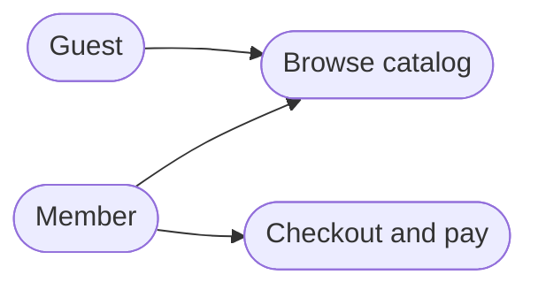
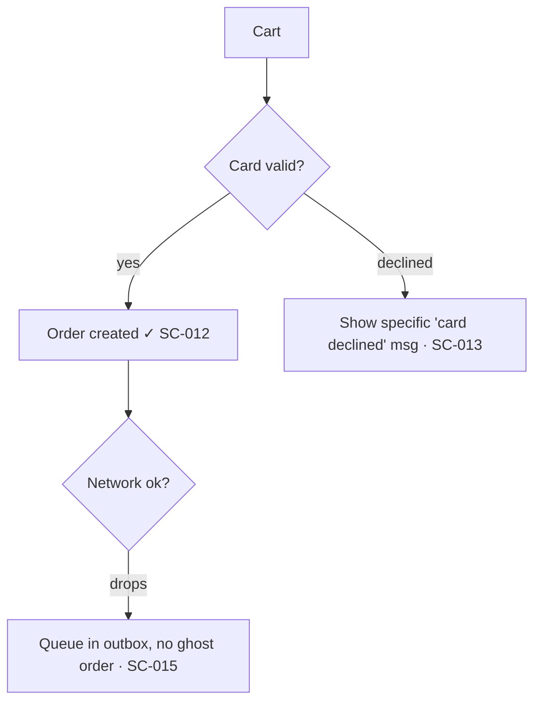

---
paths:
  - "**/specs/**"
  - "**/spec*.md"
  - "**/tasks*.md"
  - "**/plan*.md"
  - "**/SCENARIOS.md"
---

# Scenario map rule (`specs/SCENARIOS.md` — the living exploded view)

Every project keeps a single living **scenario map** at `specs/SCENARIOS.md` — an exploded view ("sprängskiss") of every conceivable scenario and use case across the whole project. It is the source from which the rest of the pipeline is derived:

- **Happy-path scenarios** → the functional-coverage inventory (one test per happy scenario).
- **Edge / adversarial / error scenarios** → the destructive E2E suite (Playwright/Maestro) and the risk-tiered count.
- **Invariants implied by the scenarios** → Allium `rule`/`invariant` entries.

The map answers one question at a glance that nothing else in the pipeline answers: *"have we thought of everything yet?"* It is a **surveyable, visual artifact** — not just a ledger of rows. It grows with the project — it is never "finished".

## What the map contains — visual overview (tiered), backed by the SC-id ledger

The map is **diagram-led**. The visual artifacts give the bird's-eye view; the SC-id table is the detailed backing that drives tests. Diagrams are **Mermaid** (renders in GitHub / VS Code / Obsidian, diffable, lives next to the code). Every diagram's nodes/steps carry the `SC-id`s so the picture and the ledger stay in lockstep.

**Always (every project / behaviour-changing feature):**
- **Use case diagram** — project-level overview of *who can do what*. Mermaid `flowchart LR`: actors as plain nodes, use cases as stadium `([…])` nodes.
- **User flow / flowchart** — one per feature: steps + decision diamonds + the error/empty branches. Mermaid `flowchart TD`. This is the workhorse — the branches ARE the scenarios.
- **SC-id table** — the detailed ledger (every happy/edge/adversarial/error row + validation status).

**On-demand (when it adds value):**
- **Journey map** — for key end-to-end journeys. Mermaid `journey` (stages, actions, satisfaction per touchpoint).
- **Wireflow** — when screens exist: a `flowchart` whose nodes are *screens*, each optionally linking to a Figma / Claude Design frame.
- **Storyboard** — for novel/complex UX: a numbered frame sequence (or `sequenceDiagram`) telling one user's narrative.

## Format

````markdown
# Scenario map

Living, surveyable exploded view of every scenario. Append as the project grows; never reuse an SC-id.
Status:  ☐ mapped  ·  ◐ tested  ·  ✓ validated (proven to actually work at runtime)

## Use case overview (who can do what)



## Actor: Member

### Feature: Checkout   (spec: 003-checkout)

User flow:



| ID     | Type        | Scenario                              | Expected outcome                          | Status |
|--------|-------------|---------------------------------------|-------------------------------------------|--------|
| SC-012 | happy       | Pay with a valid card                 | Order created, receipt shown              | ✓      |
| SC-013 | error       | Card declined                         | Specific, visible "card declined" message | ✓      |
| SC-014 | adversarial | Double-submit the pay button (race)   | Exactly one order (idempotent)            | ◐      |
| SC-015 | error       | Network drops mid-payment             | Queued in outbox, no ghost order          | ☐      |
| SC-016 | offline     | Pay while offline, reconnect later    | Sync on reconnect, single order           | ☐      |

<!-- On-demand: add a ```mermaid journey``` for the key end-to-end journey, a wireflow
     (flowchart of screens, linking design frames), or a storyboard for novel UX. -->

## Scenario history
- 2026-06-15 — initial map seeded from spec 001
````

- **SC-id** — `SC-NNN`, three digits, globally unique, **never reused** even if a scenario is deleted (strike it through, keep the id). The same id appears in the flowchart node and the table row.
- **Type** — one of `happy` · `edge` · `adversarial` · `error` · `offline` (extend only with good reason).
- **Status** — `☐ mapped` (written down) → `◐ tested` (a test exists) → `✓ validated` (the test exercises the REAL behaviour and it actually works at runtime). Only `✓` counts as done.
- Group by **actor**, then **feature**, and tag each feature block with the owning spec (`NNN-slug`). The use-case diagram sits above the actors as the project overview.

## Cross-linking (traceability both ways)

- `spec.md` references the SC-ids it covers; `tasks.md` test tasks cite them.
- Test names embed the id: `Checkout_SC014_DoubleSubmit_CreatesOneOrder`, `checkout-SC014-double-submit-destructive.yaml`.
- Allium `rule`/`invariant` entries that formalize a scenario name its SC-id in a comment.

This gives a clean chain: **SC-014 → destructive test → Allium invariant → TLA+ check**. When `/tla` finds a gap, you can trace it straight back to the scenario it came from (or discover the scenario was never written down — which is itself the finding).

## When to update (continuous, every spec)

The map is touched during **every** behaviour-changing spec, as part of the pipeline (not a separate task):

1. **At spec time** (`/speckit-specify` + `/speckit-clarify`) — add the new feature's actors/scenarios: extend the use-case diagram, draw the feature's user-flow flowchart, and add the table rows. Clarify questions that surface a new edge case become a new branch in the flowchart AND a new `edge`/`error` row.
2. **At elicit time** (`/allium:elicit`) — every invariant should trace to at least one scenario; if it doesn't, add the scenario.
3. **At test time** — the happy rows become functional tests, the edge/adversarial/error rows become the destructive suite. A destructive test with no SC-id means the scenario was never mapped — add it.
4. **At `/tla` time** — counterexamples and gaps are new scenarios; add them with type `adversarial`/`error` so the next feature inherits the lesson.

Updating the map is part of "done" for the spec, the same way ticking the spec register is.

## Post-implementation validation (BLOCKING — every scenario must actually WORK)

Allium and TLA+ harden the **spec**. They prove nothing about whether the **implementation** runs. After every implementation, each scenario must be validated at runtime — a `✓` in the map means the behaviour was *observed working*, not merely that a test file exists. This is the runtime mirror of the spec-side rigor: the spec can be perfect and the login still ship with no error message.

**A scenario is `✓ validated` only when:**

1. A test **exercises the real behaviour end-to-end** — it drives the actual UI / calls the real endpoint and asserts the real outcome. A test that asserts on a stub, never invokes the function, or only checks "the page rendered" does NOT validate the scenario (this is the documented AI-test failure mode — high coverage, zero bite; the mutation gate is the backstop).
2. **All four UI states are real and present** for every interactive/async scenario — a missing one is a failed validation, not a polish item:
   - **Success** — the thing actually happens (click the map → the pin/sheet/action fires; submit → the record is created).
   - **Error** — a **specific, visible** message. Never silent, never a blank screen, never a raw stack trace. A failed login MUST say *why* (wrong password / locked / network) — "never a missing error message" is the canonical example of this rule.
   - **Empty** — zero results shows a real empty state, not a blank void.
   - **Loading** — feedback during async, and it must resolve (no infinite spinner).

**Critical-path-first ordering (why a broken prerequisite is a hard stop):**

Validate foundational scenarios **before** the ones that depend on them. If you cannot log in, every scenario behind auth is untestable — a green suite below a broken prerequisite is meaningless. So:

- Smoke the critical path first (can you authenticate? does the primary interaction fire?), then fan out to the deeper scenarios.
- If a prerequisite scenario fails validation, **STOP and fix it before continuing** — it invalidates everything downstream. Do not write 90 destructive tests for a checkout that can't be reached because the map click does nothing.
- Mark the dependency in the map when it isn't obvious (e.g. note that SC-040..060 all sit behind SC-001 login).

Update each scenario's **Status** in `specs/SCENARIOS.md` as it moves `☐ → ◐ → ✓`. The spec/feature is not done until its scenarios are `✓`. A `/tla` or Allium finding that traces to a scenario also flips that scenario back below `✓` until re-validated.

## Scenario gap or drift → START AN INTERVIEW (BLOCKING — do not paper over it)

Missing user-cases are the root cause of "we forgot that in the code". A scattered reminder is not enough — when the scenario map is **incomplete** or a spec/implementation has **drifted** from it, Claude MUST stop and run a **scenario interview** to capture the missing cases *before* continuing. This is a legitimate stop under `continuous-execution.md` (genuine missing requirements), and it is the only safe response to a gap.

**Triggers — any one of these starts the interview:**

1. **No map yet** — `specs/SCENARIOS.md` does not exist and the current spec has interactive behaviour.
2. **Unmapped behaviour** — a `spec.md` / `tasks.md` describes an actor, feature, or flow that has no corresponding rows in the map.
3. **Test/code drift** — a destructive test, functional test, or implementation references a scenario (an `SC-id` or a behaviour) that is not in the map, OR a mapped scenario has no implementation/test.
4. **Allium / TLA+ drift traceable to a missing scenario** — `/allium:distill` or `/tla` surfaces behaviour with no SC-id behind it (per `validation-followup.md`, each such finding is a scenario to add).

**The interview (use `AskUserQuestion`, one feature at a time):**

- For each actor × feature, ask the user to confirm or fill the four scenario classes: **happy**, **edge**, **adversarial** (race/double-submit/tamper), **error** (network/timeout/auth-expiry), plus **offline** where relevant.
- Pair every question with a **recommended answer** derived from the spec and the codebase — the user confirms or corrects, they don't start from a blank page. (Single-model self-assessment of "did I cover everything?" is weak; the interview makes the human the completeness check.)
- Keep going until the user signals the feature's scenarios are complete, then write them into `specs/SCENARIOS.md` as BOTH the visual artifacts and the ledger: update the project **use-case diagram** if a new actor/use case appeared, draw/refresh the feature's **user-flow flowchart** (every branch is a scenario, error/empty branches included), add the new `SC-id` rows to the table, and append a line to **Scenario history** noting what the interview added and why. A scenario that exists as a row but not in the flowchart isn't surveyable — put it in both.
- Only then resume the pipeline. The newly-captured scenarios immediately feed the functional inventory and the destructive suite.

Do NOT silently invent the missing scenarios and move on — inventing them is the same failure as missing them, just hidden. Ask.

## Enforcement

- **PostToolUse reminder** (`scripts/scenario-map-reminder-hook.sh`, advisory — never blocks): fires when a `spec*.md` / `tasks*.md` / `plan*.md` gains interactive behaviour but `specs/SCENARIOS.md` lacks rows for it. The reminder explicitly instructs Claude to **start the scenario interview above**, not merely to jot a note. The hook is silent on template/scratch repos (no language marker) and on non-behaviour specs.
- The map is seeded by `/project-wizard` at project inception (the inception interview is the first scenario interview) and grows from there.
- Drift detection rides alongside Allium/TLA+: the scenario map is the human-readable layer above the Allium baseline, so `/tla`'s drift report and the scenario map stay in lockstep.

## What this rule forbids

- Writing a destructive test for a scenario that isn't in the map (map it first, or as you write the test).
- Treating `SCENARIOS.md` as write-once — it is a living document; a spec that adds behaviour and leaves the map untouched is incomplete.
- Reusing an `SC-id`. Ids are permanent handles for traceability.
